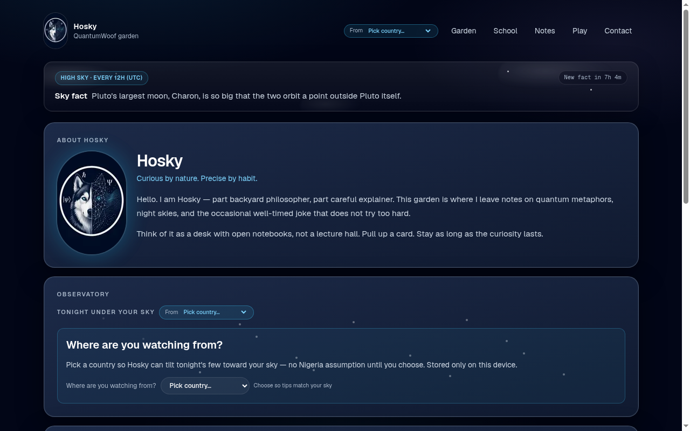

# Joshua Jubelo · Quantumwoof

Indie builder in **Nigeria**. Two pillars: **Hosky** — an astronomy digital garden at [quantumwoof.io](https://www.quantumwoof.io) — and **Nigeria AI agents** for remittance and everyday money (see [naira-pulse](https://github.com/Quantumwoof/naira-pulse) and sibling repos).

> **Hackathon lab vs garden:** this repo is the Hosky garden. Agent repos (`naira-pulse`, `edge-remit`, `naira-remit`, `voice-remit-ng`, …) are separate hackathon work — not part of this site.



Personal dog-garden site for **Hosky** — bento cards, live-feeling widgets, notes.
Includes **Woof School** (open campus micro-lessons). Built with **Next.js (App Router)**, **TypeScript**, and **Tailwind CSS**.

## Run locally

```bash
git clone https://github.com/Quantumwoof/quantumwoof.git && cd quantumwoof
bun install
bun run dev
```

Then open http://localhost:3000

Other scripts:

```bash
bun run build
bun run start
bun run lint
```

`npm` / `npx` also work if you prefer.

## Where to swap socials and contact

Edit `src/content/site.ts`:

- `socials.x`, `socials.github`, `socials.bluesky`, `socials.handle`
- `contact.email` (`hello@quantumwoof.io`)
- `domainNote` when DNS or branding changes

Field notes live in `src/content/sky/notes.ts` (re-exported via `src/content/notes.ts` for routes).

## Brand mark

- Source copy: `public/hosky-mark.png` (also `hosky-mark.jpeg`)
- Homepage screenshot: `docs/homepage.png`

## Key pages

| Path | What |
|------|------|
| `/` | Garden home — about, status, sky fact, observatory, Sky desk / Woof School, play, socials |
| `/school` | Woof School campus map + Nebula Sniffer progress |
| `/school/[topic]` | Micro-lessons + tiny woof check |
| `/notes` | Notes index |
| `/notes/[slug]` | Individual note |
| `/play` | Woof games |

## Public API (JSON)

Simple App Router GET routes — curated content, no database. CORS allows public GET.

| Method | Path | Response |
|--------|------|----------|
| `GET` | `/api/health` | `{ ok, service, time }` |
| `GET` | `/api/sky-fact` | Current 12h-slot astronomy fact (`fact`, `slot`/`index`, `nextChangeAt`, `hoursLeft`) |
| `GET` | `/api/tonight-stars?country=NG` | Hemisphere + tonight’s stars/constellations (default country `NG`) |
| `GET` | `/api/wooftag/status` | Daily Wooftag bowl (`remaining`, `minted`, cap 200 UTC) |
| `POST` | `/api/wooftag/mint` | Issue Wooftag (plaintext once; server stores hash only) |

Examples:

```bash
curl https://www.quantumwoof.io/api/health
curl https://www.quantumwoof.io/api/sky-fact
curl "https://www.quantumwoof.io/api/tonight-stars?country=NG"
```

Local: `http://localhost:3000/api/...` after `bun run dev` or `bun run start`.

## Wooftags (Nebula Sniffer tip)

On **Certified Nebula Sniffer** unlock, Hosky *issues* a Wooftag (not a Cardano send).

- Format `WOOF-XXXX-XXXX-XXXX-XXXX` (~80 bits, Crockford-like alphabet, no I/L/O/U)
- Shown once with a copy button; this browser also keeps a localStorage backup
- Server stores **only** `SHA-256(tag + WOOFTAG_PEPPER)` — never plaintext
- Future claim of 1B Quantumwoof: **Claim opens later**. Framed as a tip, not earnings
- Cap: **200 new tags per UTC day** (unused slots do not roll over). Overflow FIFO queue drains after 00:00 UTC first, then new mints fill remaining slots
- One mint per browser: durable httpOnly cookie `qw_wooftag_browser` bound in the store — clearing localStorage alone cannot remint

### Env (Vercel)

Set in Project → Settings → Environment Variables (Production + Preview):

| Variable | What |
|----------|------|
| `WOOFTAG_PEPPER` | Long random secret used when hashing tags |
| `UPSTASH_REDIS_REST_URL` | Upstash Redis REST URL |
| `UPSTASH_REDIS_REST_TOKEN` | Upstash Redis REST token |

Vercel KV aliases `KV_REST_API_URL` + `KV_REST_API_TOKEN` also work.

`bun run build` does **not** need these. Local `bun run dev` without Redis uses an in-memory store (lost on restart). Production without KV returns a graceful error — no silent file fallback.

See `.env.example`.

## License

MIT — see [LICENSE](LICENSE).

## Aesthetic

Navy + white + slate + electric blue / soft lavender; rounded bento cards; clean sans (Geist).
